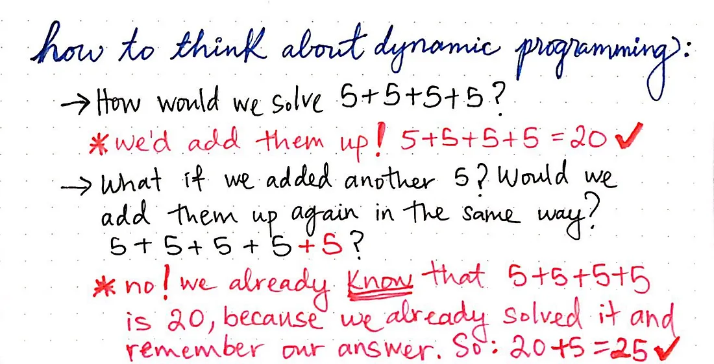
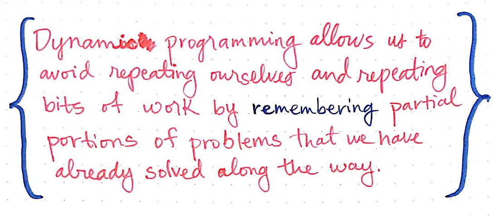
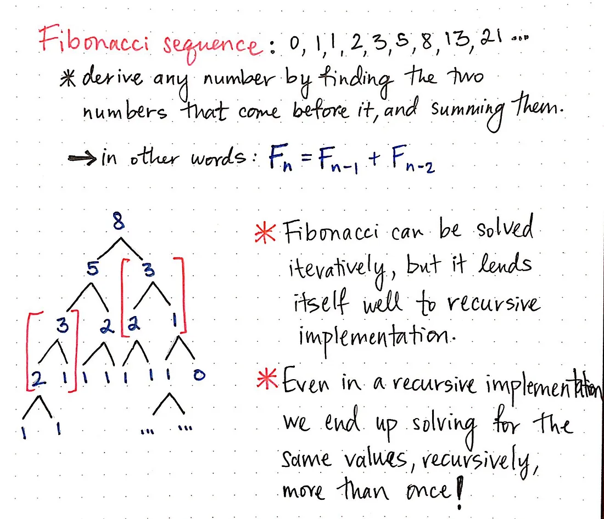
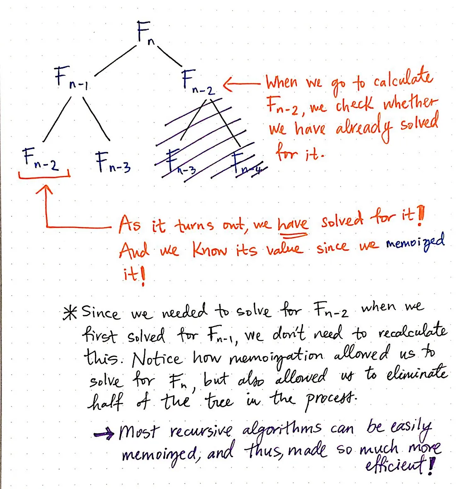
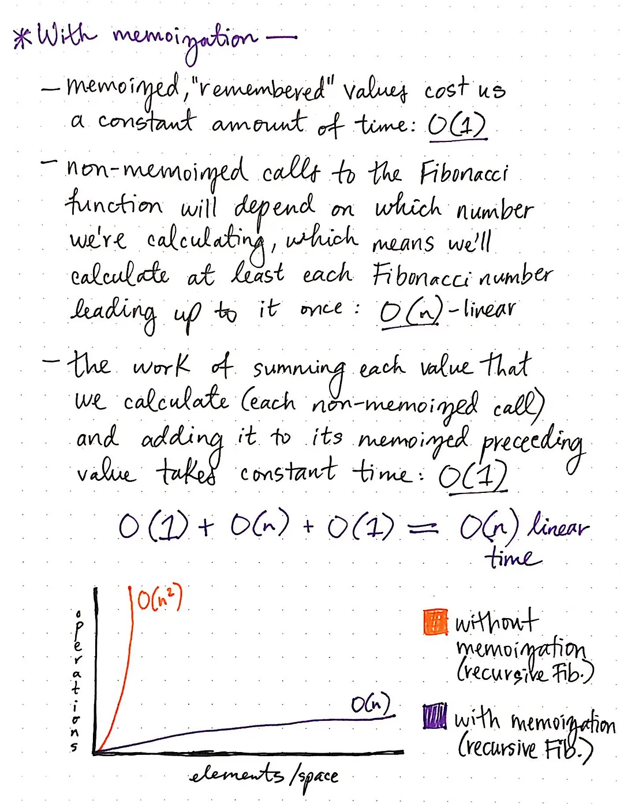

# Dynamic Programming

Dynamic programming amounts to breaking down an optimization problem into simpler sub-problems, and storing the solution to each sub-problem so that each sub-problem is only solved once.

### Reference

https://medium.com/basecs/less-repetition-more-dynamic-programming-43d29830a630

### Remember to remember

The trick to calculating all of the solutions to the various subproblems (and then choosing the best one) is remembering previous solutions.




### Identifying a Dynamic Programming Problem

1. **Optimal substructure**: The problem can be broken down into smaller subproblems, and the optimal solution of the original problem can be determined from the optimal solutions of these smaller subproblems.
2. **Overlapping subproblems**: The problem has subproblems that are solved multiple times. This property allows us to save computation time by memoizing or caching the results of these subproblems.

### Steps to solve a dynamic programming problem

1. Identify if the problem exhibits optimal substructure and overlapping subproblems.
2. Define the structure of the problem and the desired output.
3. Break down the problem into smaller, overlapping subproblems.
4. Create a memoization table to store the results of subproblems to avoid redundant calculations.
5. Write a recursive solution to the problem using the memoization table.
6. Convert the recursive solution to an iterative one, if possible, for better performance.

### Example: Fibonacci Sequence





#### Brute Force Approach

```
int fib(int n) {
    if (n <= 1) return n;
    return fib(n - 1) + fib(n - 2);
}

Time Complexity: O(2^N)
Space Complexity: O(N) due to call stack
```

#### Top-Down DP (Memoization)

```
int fib(int n, std::vector<int>& dp) {
    if (n <= 1) return n;
    if (dp[n] != -1) return dp[n];
    return dp[n] = fib(n - 1, dp) + fib(n - 2, dp);
}

Time Complexity: O(N)
Space Complexity: O(2N) for memoization vector and recursion stack
```

#### Bottom-Up DP (Tabulation)
```
int fibonacci(int n) {
    if (n <= 1) return n;
    std::vector<int> dp(n + 1);
    dp[0] = 0;
    dp[1] = 1;
    for (int i = 2; i <= n; ++i)
        dp[i] = dp[i - 1] + dp[i - 2];
    return dp[n];
}

Time Complexity: O(N)
Space Complexity: O(N) for memoization vector
```

#### Space Optimized Iterative

```
int fibonacci(int n) {
    if (n <= 1) return n;
    int prev1 = 1, prev2 = 0, curr;
    for (int i = 2; i <= n; ++i) {
        curr = prev1 + prev2;
        prev2 = prev1;
        prev1 = curr;
    }
    return curr;
}

Time Complexity: O(N)
Space Complexity: O(1)
```

| Approach                  | Time Complexity | Space Complexity |
| ------------------------- | --------------- | ---------------- |
| Brute Force Recursion     | `O(2^n)`        | `O(n)`           |
| Memoization (Top-Down)    | `O(n)`          | `O(n)`           |
| Tabulation (Bottom-Up)    | `O(n)`          | `O(n)`           |
| Space-Optimized Iterative | `O(n)`          | `O(1)`           |
